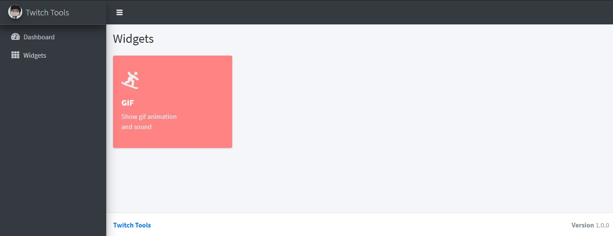

# Twitch Tool WebApp

Twitch Tool WebApp is a tool like streamlabs



## Folder Structure
--------------
    webapp
    ├── controllers             # Controller files
    ├── middleware              # Middleware files
    ├── public                  # Static files (`js`, `css`, `images`, `upload`)
    ├── services                # HTTP (express), WebSocket (socket.io)
    ├── views                   # View (`ejs`)
    ├── widgets                 # Widget module
    ├── example.js              # Example code 
    ├── index.js
    └── README.md

## Widgets

## Alerts Widget
display multiple GIF on screen and play sound

### Usage
example "9armbot.js"
```javascript
const webapp = require("../webapp");

//show GIF
webapp.socket.io().emit("widget::alerts", {
    itemKey: 0 //<-- GIF #0
})

webapp.socket.io().emit("widget::alerts", {
    itemKey: 1 //<-- GIF #1
})

//show GIF and Text
webapp.socket.io().emit("widget::alerts", {
    itemKey: 0, //<-- GIF #0
    message: "Hello"
})
``` 

or another example in `/webapp/example_alerts.js`
```shell
node webapp/example_alerts.js
```
see GIF at http://localhost:3000/widgets/alerts click -> "Launch" 

## GIF Widget
display single GIF on screen and play sound


### Usage
example "9armbot.js"
```javascript
const webapp = require("../webapp");

//show GIF
webapp.socket.io().emit("widget::gif")

//show GIF and Text
webapp.socket.io().emit("widget::gif", {
    message: "Hello"
})
``` 

or another example in `/webapp/example.js`
```shell
node webapp/example.js
```
see GIF at http://localhost:3000/widgets/gif click -> "Launch" 

## WebApp
webapp listening at http://localhost:3000
(can access localhost only)

### change port

```shell
PORT=4000 node 9armbot/9armbot.js
```

### change host
HOST=0.0.0.0 access any ip
```shell
HOST=0.0.0.0 node 9armbot/9armbot.js
```